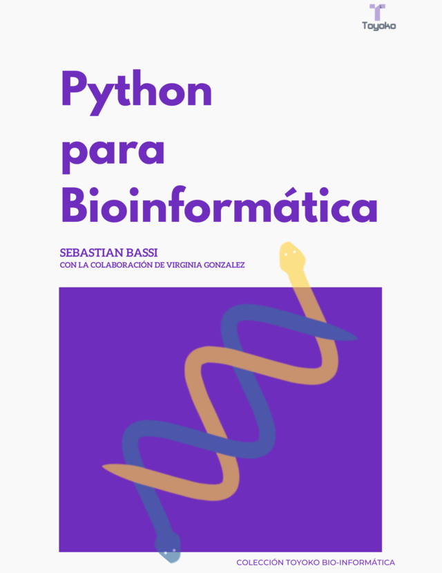

# Python para Bioinformática, en español y open source

Una sólida introducción a la programación con Python, muy accesible para los lectores sin experiencia previa en programación. Python for Bioinformatics está pensado para biólogos, bioinformáticos y otros profesionales de las ciencias de la vida.

### Sobre este libro

Primera edición en español de Python for Bioinformatics. Esta traducción es de la segunda edición en inglés (la más actual). Hubo muchos cambios desde la primera edición que fue escrita en 2009, como el uso de Python 3. En este momento el estándar es 3.8 y es la versión usada en el libro. Con respecto a la versión original se agregó un capítulo sobre gráficos, se incluyeron las bases de datos NoSQL y se explica un framework web en su totalidad.

El libro cuenta con cuatro secciones principales:

* Python desde cero: Conceptos básicos de programación, instalando Python, modo interactivo, editores, tipos de datos (cadenas, Unicode, listas, tuplas, diccionarios, conjuntos), control de flujo (If-Else, For, While), funciones, generadores, módulos, uso de archivos incluidos CVS, JSON y archivos de operaciones, manejo de errores y programación orientada a objetos.
* Biopython: Los módulos mas importante explicados con ejemplos de uso.
* Una sección con tópicos avanzados tales como: desarrollo web (CGI y Bottle), XML, base de datos (MySQL, SQLite y MongoDB), REGEX y gráficos (Bokeh).
* Recetas de Python con código comentado.

### Sobre la publicación

En este directorio están los archivos que conforman la versión en español del libro "Python para Bioinformática".

Estos archivos son para editar el libro, ya sea para hacer una copia propia o para proponer modificaciones: enviar correcciones, sugerir nuevos temas, agregar nuevos capítulos, traducirlo a otros idiomas (portugués por ejemplo), etc. Las contribuciones son bienvenidas.

Si están interesados en el libro listo para leer, lo pueden descargar gratuitamente en [Leanpub](https://leanpub.com/pythonparabioinformatica/) (también está la opción de pagar en el caso que se sientan generosos).

### Tabla de contenidos

[Prefacio a la primera edición en Español](/prefacio.txt)

[Dedicatoria](/agradecimientos.txt)

* Capítulo 1 [Introducción](chapter1.txt)
* Capítulo 2 [Primeros pasos con Python](chapter2.txt)
* Capítulo 3 [Programación básica: Tipos de datos](chapter3.txt)
* Capítulo 4 [Programación: Control de flujo](chapter4.txt)
* Capítulo 5 [Manejo de archivos](chapter5.txt)
* Capítulo 6 [Modularización del código](chapter6.txt)
* Capítulo 7 [Manejo de errores](chapter7.txt)
* Capítulo 8 [Introducción a la programación orientada a objetos (POO)](chapter8.txt)
* Capítulo 9 [Introducción a Biopython](chapter9.txt)
* Capítulo 10 [Aplicaciones Web](chapter10.txt)
* Capítulo 11 [XML](chapter11.txt)
* Capítulo 12 [Python y bases de datos](chapter12.txt)
* Capítulo 13 [Expresiones regulares](chapter13.txt)
* Capítulo 14 [Gráficos en Python](chapter14.txt)
* Capítulo 15 [Manipulación de secuencias en Batch](chapter15.txt)
* Capítulo 16 [Aplicación web para filtrar contaminación de vectores](chapter16.txt)
* Capítulo 17 [Buscando primers de PCR usando Primer3](chapter17.txt)
* Capítulo 18 [Calculando la temperatura de melting de un conjunto de primers](chapter18.txt)
* Capítulo 19 [Filtrando campos específicos de un archivo de GenBank](chapter19.txt)
* Capítulo 20 [Infiriendo sitios de splicing](chapter20.txt)
* Capítulo 21 [Dibujando posiciones de marcadores usando información almacenada en una base de datos](chapter21.txt)
* Capítulo 22 [Dibujando posiciones de marcadores usando información almacenada en una base de datos](chapter22.txt)
* Capítulo 23 [Mutaciones de ADN con restricción](chapter23.txt)

 Esta obra está bajo una <a rel="license" href="http://creativecommons.org/licenses/by-nc-sa/4.0/">Licencia Creative Commons Atribución-NoComercial-CompartirIgual 4.0 Internacional</a>.
